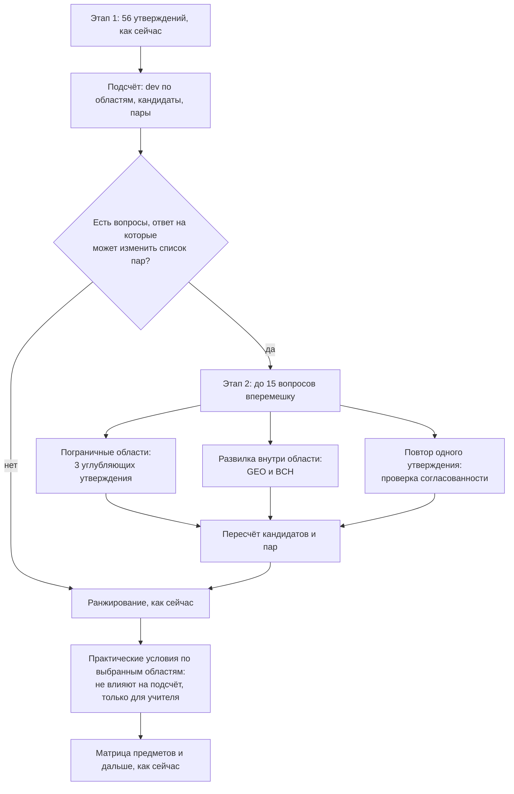

# Адаптивное углубление (этап 2) — проект v3.0

Статус: **черновик для обсуждения**, в коде ничего не сделано. Версия 2.2 сохранена в git под меткой
`v2.2` (вернуться: `git checkout v2.2`; архив на GitHub: Releases/Tags → v2.2).

## Зачем

После 56 общих утверждений у нас есть догадка о профиле. Часть итоговых пар при этом держится на
тонкой грани: область прошла порог на 0,1 балла или не прошла на 0,1. Четыре утверждения на область
дают погрешность, сравнимую с этой разницей. Этап 2 задаёт немного дополнительных вопросов
**только там, где ответ может изменить итоговый список пар**, и не тратит время ученика на остальное.

## Что не меняется (правила проекта)

1. **Этап 1 одинаков для всех**: те же 56 утверждений и 2 проверки внимания, тот же порядок, те же id.
   По нему считаются `dev_*`, качество и всё, что пишется в таблицу сейчас. Данные v2.2 и v3.0
   сравнимы.
2. **Пара по-прежнему выводится из интереса к области** через список НЦТ. Этап 2 уточняет интерес,
   а не подменяет его оценками или любимыми предметами.
3. **Никаких вердиктов**: результат остаётся коротким списком «мүмкін бағыт», который ученик сам
   ранжирует.
4. **Новые вопросы — с новыми id**; старые id и коды не трогаем.
5. Сайт сохраняет и результат по этапу 1 (`pairs_stage1`), и итоговый (`pairs`). Так на данных
   видно, что именно изменил этап 2, и можно отключить его, если он не помогает.

## Как устроено

### Блок 1. Пограничные области

Порог кандидата сейчас: «отстаёт от лидера меньше чем на 0,8». Пограничная область — та, что
ближе к этому порогу, чем на погрешность измерения, **с любой стороны**:

    порог = dev лидера − 0,8
    пограничная, если |dev области − порог| < зона

До пилота `зона = 0,3`. После пилота она заменяется стандартной ошибкой балла области
(SEM = SD × √(1 − α), считается по данным первого потока), то есть станет обоснованной, а не
придуманной.

Каждой пограничной области задаются 3 новых утверждения той же шкалы 1–5. Новый балл области — среднее
по всем её 7 утверждениям минус **личное среднее из этапа 1** (оно не пересчитывается, чтобы этап 2
не сдвигал остальные области). Затем кандидаты и пары считаются заново по тем же правилам.

**Защита от самоподтверждения.** Углубляем пограничные области и над порогом, и под ним, всегда
одинаковым числом вопросов. Лидера не углубляем: он уже выше порога с запасом. Отвергнутые
(dev ≤ −0,8) тоже не углубляем: это ваше «удостовериться, что точно не подходит» — они не
пограничные, значит уже подтверждены. Если пограничных больше трёх, берём три ближайших к порогу.

### Блок 2. Развилки внутри области

По `docs/nct-groups.csv` развилки по парам есть только в двух областях:

| Область | Пара А | Пара Б | Программы |
|---|---|---|---|
| GEO Жер және қоршаған орта | BG Биология – География | MG Математика – География | А: окружающая среда, лесное хозяйство. Б: наука о Земле, кадастр |
| BCH Биология, химия, агроғылым | BC Биология – Химия | CP Химия – Физика | Б: только химическая инженерия (B060) |

Если область в кандидатах, задаём по 2 утверждения на каждую ветку. Сейчас GEO даёт сразу две пары;
если одна ветка выше другой на 1 балл и больше, остаётся только она. Иначе остаются обе, как сейчас.
BCH сейчас всегда ведёт к BC, а ветка CP добавляется только при явном перевесе.

Остальные «развилки» (учитель какого предмета, колледж после 9 класса, спорт и искусство) уже
решаются вопросами анкеты и в этап 2 не входят.

### Блок 3. Проверка согласованности

Одно утверждение этапа 1 из области-лидера повторяется дословно, в середине этапа 2. Если ответ
отличается на 2 балла и больше, ставится флаг `inconsistent`. Это дешёвая и понятная замена третьей
проверке внимания, и она же даёт оценку надёжности на пилоте.

### Блок 4. Практические условия (после ранжирования)

Для 1–2 областей, которые ученик поставил выше всего, — по 3 вопроса «иә / мүмкін / жоқ» о том,
что обычно не связано с интересом, но решает на практике. Ответы **не участвуют в подсчёте**:
они попадают в таблицу для разговора на разборе.

| Область | Примеры (черновик, ru) |
|---|---|
| MED | Готов(а) учиться 6–7 лет до самостоятельной работы · Спокойно отношусь к виду крови и травм · Готов(а) к ночным дежурствам |
| IT | Мне нравится сам процесс поиска ошибки в программе · Готов(а) часами работать за компьютером · Интересно не только играть в игры, но и разбираться, как они сделаны |
| ART | Знаю, какой творческий экзамен сдают на выбранную программу · Готов(а) собрать портфолио работ · Занимаюсь этим вне школы |
| LAW | Готов(а) много читать и запоминать тексты законов · Готов(а) спорить и отстаивать позицию публично · Готов(а) работать в строгом подчинении |

Полный список — по 3 вопроса на каждую из 14 областей.

## Сколько это добавляет

| Блок | Вопросов | Когда задаётся |
|---|---|---|
| Пограничные | 0–9 | если есть пограничные области |
| Развилки | 0–4 | GEO или BCH среди кандидатов |
| Согласованность | 1 | всегда, если этап 2 вообще есть |
| Практические | 3–6 | всегда, после ранжирования |
| **Итого** | **до 15 + 6** | около 3–4 минут сверху |

Если пограничных областей и развилок нет, этап 2 пропускается целиком. Ученику он показывается как
«Тағы бірнеше нақтылау сұрағы»: без названий областей, вопросы разных областей вперемешку, чтобы не
подсказывать, «что от него ждут».

## Веса вопросов

До пилота у всех утверждений вес 1. В `questionnaire.js` сразу появится поле `weight`, чтобы потом
не переделывать код. После первого потока (нужно 80–150 качественных анкет; для полной модели IRT —
300 и больше) по листу Raw считаем:

1. **Скорректированную корреляцию «утверждение — своя область»** (без самого утверждения).
   Ниже 0,3 — утверждение плохо измеряет область: переписать или убрать.
2. **Разброс ответов.** Если почти все отвечают одинаково, утверждение мало что различает.
3. **α Кронбаха по каждой области** и SEM — отсюда ширина пограничной зоны (блок 1).
4. Когда данных станет достаточно — **модель градуированных ответов (IRT, GRM)**. Она даёт
   информативность каждого утверждения на разных уровнях интереса. Это и есть «вес по тому, сколько
   информации даёт вопрос». С ней этап 2 можно сделать полностью адаптивным: выбирать следующее
   утверждение с наибольшей информацией в зоне порога.

Пересчёт делается скриптом по листу Raw; веса записываются в `questionnaire.js`, версия поднимается.

## Новые данные в таблице

Responses: ответы на новые id (`ENG_D1…ENG_D3`, `GEO_BG1`, `GEO_MG1`, `BCH_BC1`, `BCH_CP1`,
`PR_MED1…`, `REPEAT_ID`, `REPEAT_VAL`); неспрошенные остаются пустыми.

Scores: `adaptive_asked` (какие id заданы), `borderline` (пограничные области), `pairs_stage1`,
`fork_GEO`, `fork_BCH`, `inconsistent`, `practical_flags` (ответы «жоқ» по практическим условиям).

## Проверки до запуска

1. Тесты на подсчёт: пограничность, симметрия углубления, развилки, остановка, лимит 15.
2. **Симуляция**: тысячи синтетических учеников с заданным «истинным» профилем и шумом в ответах.
   Сравнить, как часто итоговые пары совпадают с истинными при v2.2 и при v3.0. Если этап 2 не
   улучшает совпадение, он не нужен — так мы проверим идею до того, как тратить время учеников.
3. На пилоте: доля учеников, у которых этап 2 изменил пары (`pairs_stage1` ≠ `pairs`), и связь
   `inconsistent` с остальными флагами качества.

## Что нужно написать

| Что | Сколько текстов (каждый на kk и ru) |
|---|---|
| Углубляющие утверждения | 14 областей × 3 = 42 |
| Развилки GEO и BCH | 8 |
| Практические условия | 14 × 3 = 42 |
| Экран этапа 2 и подсказки | ~5 |

Предлагаемый порядок: сначала блоки 1–3 (50 текстов) и симуляция; блок 4 — отдельным шагом.

## Решения за владельцем

1. Допустимая длина: до 15 дополнительных вопросов — нормально?
2. Практические условия (блок 4): нужны ли вообще, и по каким областям в первую очередь?
3. Черновики утверждений пишу я на русском, казахские версии — вы или вычитка носителем?
4. Запускаем ли первый поток на v2.2 параллельно (рекомендую: данные нужны для весов и SEM).
